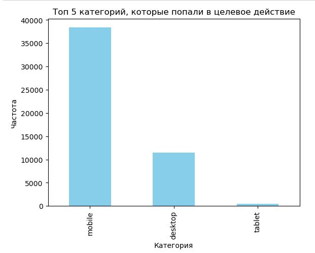
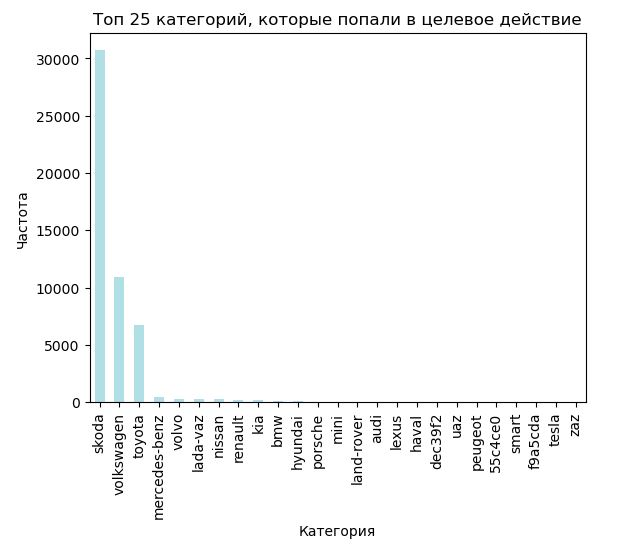

# Анализ эффективности маркетинговых каналов сервиса аренды авто

### Описание проекта
Проект посвящен анализу пользовательского поведения и оценке эффективности каналов привлечения для площадки по аренде автомобилей.

### Цель
Оптимизация маркетинговых каналов и выявление наиболее эффективных сегментов трафика.

### Стек технологий
*   **Python (`pandas`, `matplotlib`, `scipy`)**: 
    *   Обработка больших массивов данных сессий и событий.
    *   Статистическая проверка гипотез (Z-test/Chi-square).
    *   Визуализация распределения трафика и воронки конверсии.

### Описание данных
*Исходные датасеты содержат конфиденциальную информацию и не представлены в репозитории. Анализ проводился на основе двух таблиц:*
*   **ga_sessions**: данные о визитах (ID сессии, utm-метки, характеристики устройств, геоданные).
*   **hits**: данные о событиях внутри сессии (тип действия, страница события, категория и тег события).

### Ключевые этапы работы
1.  **ETL и Data Cleaning**: 
    *   Формирование единого массива данных.
    *   Заполнение пропусков в категориальных данных (использование моды).
    *   Восстановление названий и моделей авто с помощью кастомных словарей.
    *   Обогащение датасета новой информацией для расширения возможностей анализа.
2.  **EDA и проверка гипотез**: 
    *   Установлено: **органический трафик** статистически значимо отличается от платного по CR.
    *   Установлено: тип устройства (**Mobile vs Desktop**) и **география** (города присутствия vs регионы) не имеют статистически значимых различий в конверсии.
3.  **Визуализация**: Построение графиков распределения трафика и эффективности моделей авто в коде.

### Ключевые выводы
*   **Трафик**: Абсолютное лидерство принадлежит мобильным устройствам (**79%** всех визитов). Москва генерирует около **43%** всего трафика.
  

*   **Эффективность моделей**: 
    *   **Skoda** — лидер по популярности и качеству (CR = 1,8%).
    *   ** Volkswagen** — стабильное второе место (CR = 0,6%).
    *   **Toyota** — третье место (CR = 0,4%).
    

*   **Соцсети**: Канал показывает высокую эффективность — доля целевых действий составляет **5,9%**, что является хорошим показателем для масштабирования.
